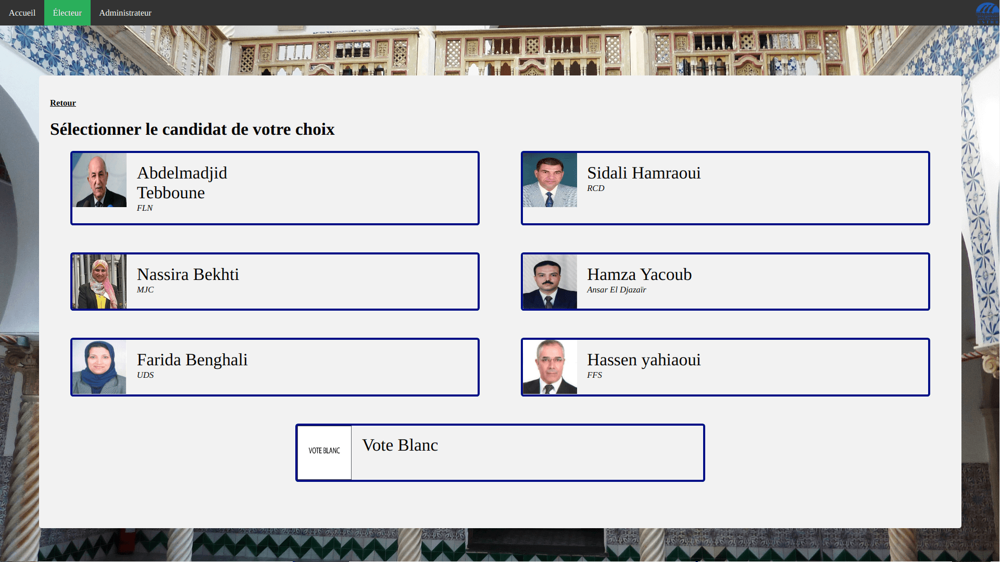
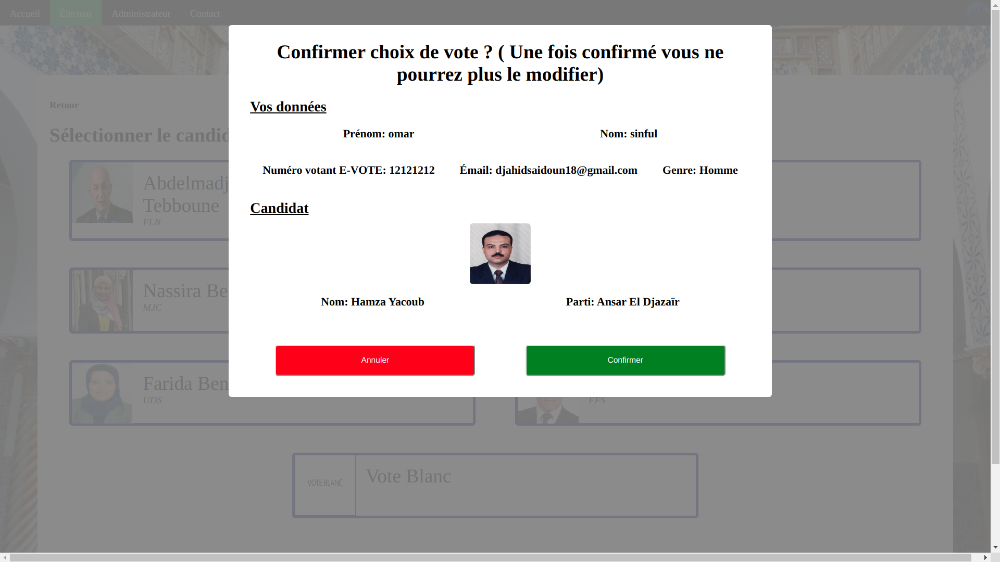
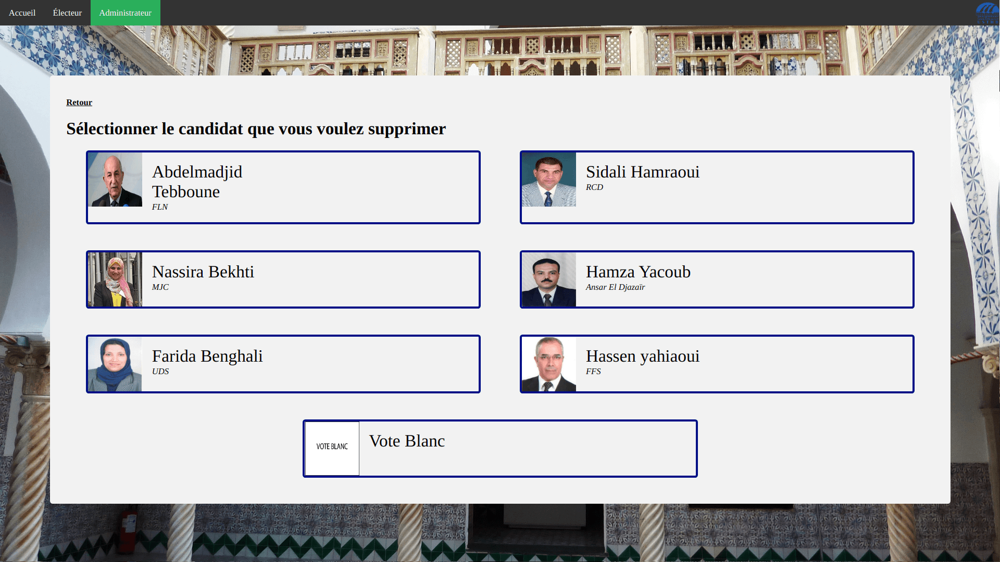
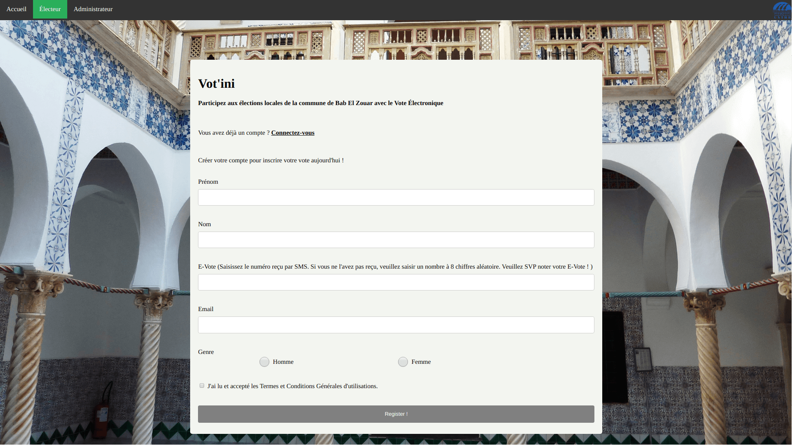

# 🗳️ Electronic Voting System

Full-stack electronic voting application developed as part of a bachelor’s degree project.  
This system simulates a real-world voting process with both software and hardware components.

---

## 🚀 Features

- Voter registration and authentication  
- Secure vote submission  
- Admin dashboard for candidate management  
- Vote counting and result display  
- Prevention of duplicate voting  

---

## 🧠 Tech Stack

Frontend  
- React.js  

Backend  
- Node.js  
- Express.js  

Database  
- MongoDB (Local & Atlas)  

Other  
- REST APIs  
- UML (System modeling)  
- Raspberry Pi (hardware prototype)  

---

## 📸 Screenshots

### 🏠 Home Page

### 🗳️ Vote Selection

### ✅ Vote Confirmation

### 🛠️ Admin Panel (Delete Candidate)

### 📝 User Registration

---

## 📁 Project Structure

- routes/ → API endpoints (vote, login, candidates, etc.)  
- db/ → Database logic  
- utils/ → Utility functions  
- public/ → Static files  
- index.js → Main server file  

---

## ⚙️ Installation

Clone the repository:

git clone https://github.com/SaidounDjahid/saidoun-tahmi-pfe-2020.git  
cd saidoun-tahmi-pfe-2020  

Install dependencies:

npm install  

---

## ▶️ Run the Application

Run MongoDB locally:

npm run mongodb  

Start the app (local database):

npm run localdb  

Start with cloud database:

npm start  

---

## 🌐 Access

http://localhost:3000  

---

## 🎓 Academic Context

Bachelor thesis project at  
USTHB – University of Science and Technology Houari Boumediene  

Topic: Design and implementation of an electronic voting system  

---

## ⚠️ Disclaimer

This project is for educational purposes only and not intended for production use.

---

## 👨‍💻 Authors

- Djahid Saidoun  
- Lynda Tahmi  

---

## 📬 Contact

Feel free to reach out for collaboration or opportunities.
